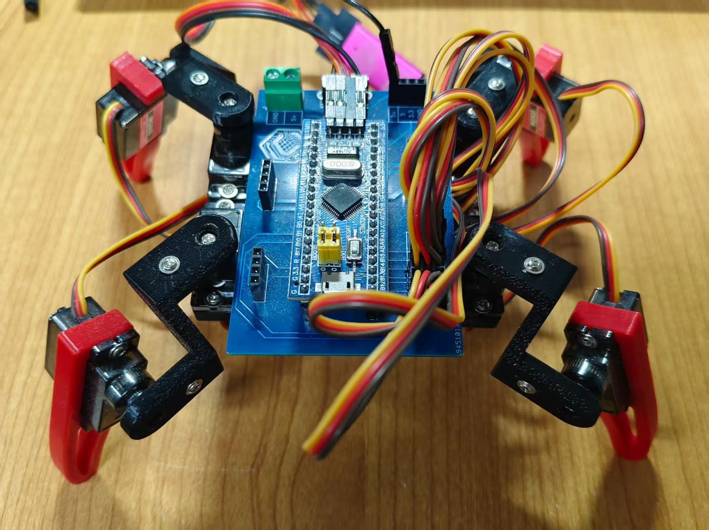

# 四足机器人前进步态研究

## 1. 项目介绍
本项目基于 STM32F103C8T6，使用 8 路舵机驱动实现四足机器人（蜘蛛形态）的基础步态控制，当前代码重点实现了前进与后退动作序列，并提供串口数据交互和 OLED 状态显示。

项目位于 spider 目录，可直接在 Keil 中打开工程文件进行编译和烧录。



核心特点：
- 基于 TIM1 + TIM3 输出 8 路 PWM，驱动 8 个舵机。
- 在 spider_con.c 中集中定义步态动作（前进、后退、自检）。
- 支持蓝牙串口控制（帧头 0xA5，帧尾 0x5A，11 字节载荷）。
- OLED 显示接收数据与连接状态，便于调试。

## 2. 运行平台与环境
- MCU：STM32F103C8T6
- 开发环境：Keil uVision（MDK）
- 代码目录：spider
- 主要依赖：STM32F10x 标准外设库（已包含在工程中）

## 3. 使用方法
### 3.1 打开工程
1. 打开 Keil uVision。
2. 选择 spider/Project.uvprojx。
3. 确认目标芯片为 STM32F103C8T6（或与硬件一致的同系列型号）。

### 3.2 编译与烧录
1. 在 Keil 中执行 Rebuild。
2. 连接下载器（如 ST-Link）并连接目标板。
3. 配置好 Download 选项后执行 Download/Flash。
4. 复位后观察舵机动作与 OLED 显示。

### 3.3 默认运行逻辑
- 上电初始化 OLED、LED、按键、串口和舵机。
- 主循环持续执行前进步态 spider_forward()。
- 若收到串口数据帧：
	- OLED 显示接收数据。
	- 按协议回传数据并计算校验位。
	- 可通过数据位控制测试 LED 开关。

## 4. 主要代码说明
- 步态控制：spider/Hardware/spider_con.c
	- spider_check()：上电自检动作
	- spider_forward()：前进动作序列
	- spider_backward()：后退动作序列
- 舵机控制：spider/Hardware/Servo.c
	- 角度映射为 PWM 脉宽：500us ~ 2500us
- PWM 驱动：spider/Hardware/PWM.c
	- TIM3（4 路）+ TIM1（4 路）共 8 路
- 串口通信：spider/Hardware/Usart1.c
	- USART2，9600 波特率，中断接收
- 主程序入口：spider/User/main.c

## 5. 项目结构
```
.
|-- README.md
`-- spider/
		|-- Project.uvprojx              # Keil 工程文件
		|-- Project.uvoptx
		|-- Hardware/                    # 硬件驱动与步态控制
		|   |-- spider_con.c/h           # 四足步态控制核心
		|   |-- Servo.c/h                # 舵机角度接口
		|   |-- PWM.c/h                  # 8 路 PWM 输出
		|   |-- Usart1.c/h               # 串口通信协议
		|   |-- OLED.c/h                 # OLED 显示驱动
		|   |-- OLED_Data.c/h            # OLED 图像/字模数据
		|   |-- LED.c/h
		|   `-- Key.c/h
		|-- User/                        # 用户主程序
		|   |-- main.c
		|   |-- stm32f10x_it.c/h
		|   `-- stm32f10x_conf.h
		|-- System/                      # 系统级组件
		|   `-- Delay.c/h
		|-- Start/                       # 启动文件、CMSIS 系统文件
		|   |-- startup_stm32f10x_*.s
		|   |-- system_stm32f10x.c/h
		|   `-- stm32f10x.h
		|-- Library/                     # STM32 标准外设库源码
		|   `-- stm32f10x_*.c/h
		|-- Objects/                     # 编译输出文件
		`-- Listings/                    # 列表与中间文件
```

## 6. 扩展方向
- 添加更多传感器和外设。
- 步态研究完毕后将主控更换为ESP32。
- 更换更好地现代开发框架

### 联系我们
点击 [我的博客](https://mingchuangyinye.shop/personalpage) 与我们取得联系

